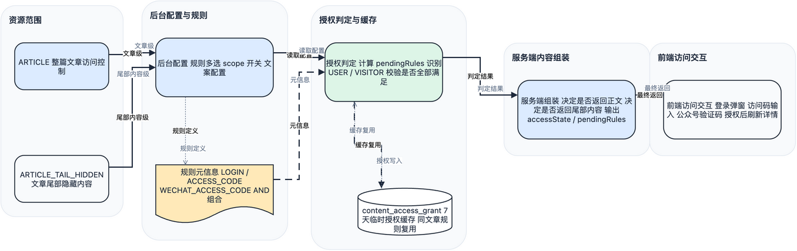
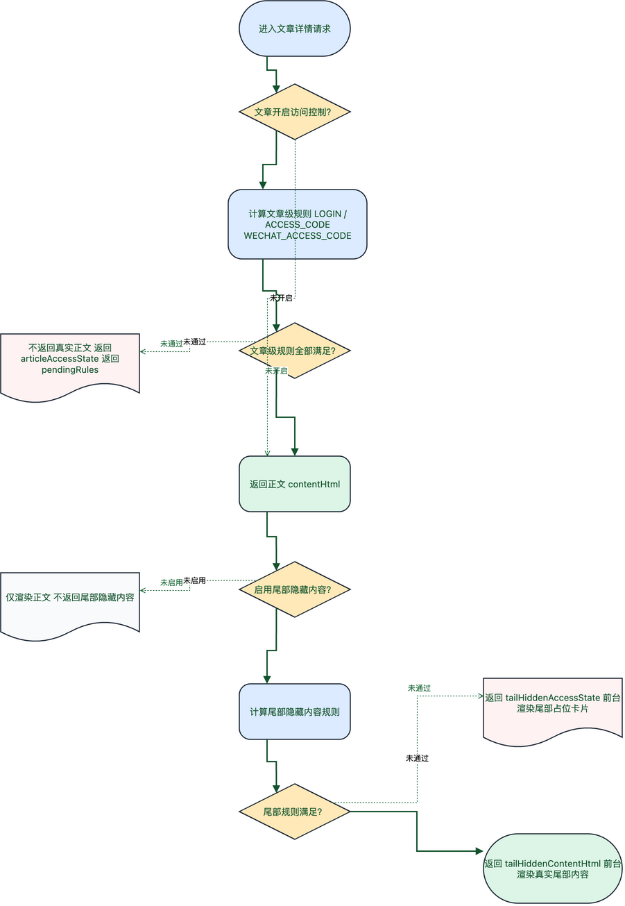

# 内容访问控制技术实现方案

## 文档目标

本文档用于定义 `Yunyu` 统一“内容访问控制”能力的技术落地方案，覆盖文章观看权限与文章尾部隐藏内容权限两种范围，并为后续扩展会员、专题、商品资源等访问控制场景提供稳定模型。

## 一、核心技术结论

## 1.1 这是“一套能力”，不是两套功能

文章观看权限与文章尾部隐藏内容权限本质上共用以下要素：

- 访问规则
- 授权主体
- 缓存策略
- 前端拦截交互
- 服务端最终裁决

因此正式结论是：

- 统一建设“内容访问控制”模块
- 不分别建设“文章权限系统”和“尾部隐藏内容权限系统”

## 1.2 服务端必须掌握最终显示权

无论是整篇文章还是尾部隐藏内容，受限内容是否返回，都必须由服务端决定。

原因：

- 只要前端已经拿到真实内容，就无法防止用户通过抓包、源码或调试工具直接看到

所以正式方案是：

- 服务端负责判断并决定是否返回真实内容
- 前端只负责交互触发、访客标识、状态展示和刷新

## 1.3 命名统一使用“访问验证码”

本方案不再使用“邀请码”。

技术字段正式统一为：

- `accessCode`
- `ruleType = ACCESS_CODE | WECHAT_ACCESS_CODE`

用户界面文案可展示为：

- `访问验证码`
- `公众号验证码`

## 二、统一模型设计

## 2.1 资源范围

统一使用 `resourceScope` 描述当前访问控制作用于什么内容：

- `ARTICLE`
- `ARTICLE_TAIL_HIDDEN`

## 2.2 规则类型

本期只保留：

- `LOGIN`
- `ACCESS_CODE`
- `WECHAT_ACCESS_CODE`

后续可扩展：

- `MEMBER_LEVEL`
- `ORDER_ENTITLEMENT`
- `TOPIC_ACCESS_CODE`

## 2.3 规则元信息

为了让规则本身保持通用，而不是被某个资源范围写死，建议为每个规则定义元信息：

```ts
interface ContentAccessRuleMeta {
  ruleType: ContentAccessRule
  supportedScopes: ContentAccessScope[]
  supportsMultiRule: boolean
  cachePolicy: 'NONE' | 'TEMP_GRANT'
  uiMode: 'LOGIN' | 'CODE_INPUT' | 'QRCODE_AND_CODE'
}
```

示例：

```ts
const ACCESS_CODE_RULE_META: ContentAccessRuleMeta = {
  ruleType: 'ACCESS_CODE',
  supportedScopes: ['ARTICLE', 'ARTICLE_TAIL_HIDDEN'],
  supportsMultiRule: true,
  cachePolicy: 'TEMP_GRANT',
  uiMode: 'CODE_INPUT'
}
```

正式建议：

- 底层 `supportedScopes` 支持多 scope
- 当前产品配置层先只在 `ARTICLE` 开放 `ACCESS_CODE`

## 2.4 授权主体

统一使用：

- `USER`
- `VISITOR`

其中：

- `USER` 适用于登录用户
- `VISITOR` 适用于未登录但通过访问验证码校验的访客

## 2.5 规则组合语义

规则从单值升级为数组配置。

本期正式采用：

- `AND`

即：

- 资源上配置的所有规则都必须满足，访问才通过

例如文章规则：

```json
["LOGIN", "ACCESS_CODE"]
```

表示用户必须同时登录并输入正确的文章访问码。

## 三、现有项目约束

结合当前仓库现状，设计时必须考虑：

1. 后台正文编辑仍以 `contentMarkdown` 为主。
2. 前端 `useMarkdownRenderer` 当前负责 Markdown 到 `contentHtml` 的派生。
3. 前台详情页直接消费后端 `contentHtml`。
4. 第一阶段不改 Markdown 语法，不做正文内嵌隐藏块。

这意味着：

- 文章级与尾部隐藏内容级控制都不能只在前端做布尔切换
- 受限内容不能在未授权时直接进入最终返回的 `contentHtml`

## 四、总体架构

统一拆成 5 层：

1. 内容资源建模层
2. 后台配置层
3. 授权判定层
4. 服务端正文与尾部内容组装层
5. 前端访问交互层

图源文件：

- 
- [01-内容访问控制整体结构图.drawio](/Users/wangpenglong/projects/full-stack-project/Yunyu/docs/技术/资源/04-内容访问控制技术实现方案/drawio/01-内容访问控制整体结构图.drawio)
- [01-内容访问控制整体结构图.md](/Users/wangpenglong/projects/full-stack-project/Yunyu/docs/技术/资源/04-内容访问控制技术实现方案/mermaid/01-内容访问控制整体结构图.md)

这张图用于统一说明第一期内容访问控制的分层关系：文章级访问控制与文章尾部隐藏内容共用同一套规则模型、授权缓存和服务端裁决链路。

## 五、资源建模方案

## 5.1 文章级访问控制

文章实体或文章内容实体上需要新增访问控制字段，建议：

- `access_rule_types`
- `access_enabled`

推荐语义：

- `access_enabled = 0`：公开
- `access_enabled = 1`：受限
- `access_rule_types` 存储规则数组，例如 `["LOGIN", "ACCESS_CODE"]`

## 5.2 文章尾部隐藏内容访问控制

第一期不做正文内嵌隐藏块，而是改为“文章尾部隐藏内容”。

推荐建模为文章的附加内容区，字段建议：

- `tail_hidden_enabled`
- `tail_hidden_title`
- `tail_hidden_rule_types`
- `tail_hidden_content_markdown`
- `tail_hidden_content_html`

限制说明：

- 当前产品版本下，尾部隐藏内容配置层不开放 `ACCESS_CODE`
- 尾部隐藏内容本期仍只支持单规则，避免第一期复杂度过高
- 正文内嵌隐藏块作为第二期 `TODO`

## 5.3 统一资源标识

为了让文章与尾部隐藏内容共用一套授权能力，建议统一定义资源标识：

- `resourceScope`
- `resourceId`
- `parentArticleId`

其中：

- 文章级：`resourceScope = ARTICLE`，`resourceId = postId`
- 尾部隐藏内容级：`resourceScope = ARTICLE_TAIL_HIDDEN`，`resourceId = postId + ":tail-hidden"`，`parentArticleId = postId`

## 六、数据模型设计

## 6.1 文章访问控制字段

建议在文章主表或内容表中新增：

- `access_enabled`
- `access_rule_types`

这样服务端在查询文章详情前就可以先判断是否要返回正文。

## 6.2 尾部隐藏内容存储结构

建议在 `post_content` 中新增并保留：

- `tail_hidden_enabled`
- `tail_hidden_title`
- `tail_hidden_rule_types`
- `tail_hidden_content_markdown`
- `tail_hidden_content_html`

结构特点：

- 与正文 `content_markdown / content_html` 分离
- 不参与正文 Markdown 解析
- 统一在详情页正文结束后渲染

## 6.3 统一授权表

建议新增统一授权表：

- `content_access_grant`

建议字段：

- `id`
- `resource_scope`
- `resource_id`
- `parent_article_id`
- `rule_type`
- `grant_subject_type`
- `user_id`
- `visitor_id_hash`
- `granted_at`
- `expires_at`
- `status`
- `created_at`
- `updated_at`

作用：

- 支撑文章级授权
- 支撑尾部隐藏内容级授权
- 支撑后续更多范围的访问授权

补充建议：

- 同时增加 `grant_key`

其值可由以下内容计算：

- `resource_scope`
- `resource_id`
- `rule_type`
- `grant_subject_type`
- `user_id / visitor_id_hash`

便于快速判断某一条规则是否已满足。

## 6.4 访问验证码配置

访问验证码本身不建议散落在文章里。

推荐统一放在站点配置中：

- `accessCode`
- `accessCodeHint`
- `accessCodeExpiresAt`
- `wechatQrCodeUrl`

其中：

- 技术字段统一用 `accessCode`
- 前端展示文案可使用“公众号验证码”

## 七、授权判定服务

## 7.1 统一服务职责

建议新增统一服务，例如：

- `ContentAccessService`

职责：

1. 判断文章是否可访问
2. 判断尾部隐藏内容是否可访问
3. 校验访问验证码
4. 签发授权记录
5. 查询当前授权是否仍有效
6. 计算多规则组合是否全部满足

## 7.2 判定输入

判定时统一使用：

1. `resourceScope`
2. `resourceId`
3. `ruleTypes`
4. 当前登录用户
5. 当前访客标识 `visitorId`

## 7.3 登录规则判定

`LOGIN` 判定逻辑：

- 当前请求存在有效登录用户则通过
- 不写入长期授权表
- 不做跨登出缓存复用

## 7.4 文章访问码规则判定

`ACCESS_CODE` 判定逻辑：

1. 先检查当前 `resourceScope` 是否在该规则的 `supportedScopes` 内
2. 检查当前用户或访客是否已有未过期授权
3. 有则直接通过
4. 没有则返回未授权状态
5. 当前台提交 `accessCode` 后，服务端校验当前资源配置的访问码
6. 校验成功后写入 `content_access_grant`
7. `expires_at = now + 7d`

## 7.5 访问验证码规则判定

`WECHAT_ACCESS_CODE` 判定逻辑：

1. 检查当前用户或访客是否已有未过期授权
2. 有则直接通过
3. 没有则返回未授权状态
4. 当前台提交 `accessCode` 后，服务端校验
5. 校验成功后写入 `content_access_grant`
6. `expires_at = now + 7d`

## 7.6 多规则组合判定

对文章级权限，服务端不再只判断单个 `ruleType`，而是判断规则数组：

```json
["LOGIN", "ACCESS_CODE"]
```

判定原则：

1. 逐条计算每个规则是否已满足
2. 只有全部满足，文章才可访问
3. 若部分满足，则返回“未满足规则列表”

返回示例：

```json
{
  "granted": false,
  "pendingRules": ["ACCESS_CODE"]
}
```

这样前端可以只展示剩余未完成的步骤。

## 7.7 授权复用原则

为了避免文章级和尾部隐藏内容级重复要求输入验证码，建议增加“规则授权复用”策略：

- 同一篇文章下
- 同一规则类型
- 当前用户 / 访客已有有效授权

则允许尾部隐藏内容直接复用文章级授权，或文章复用上层授权策略。

正式建议：

- 先做“同文章、同规则复用”
- 后续再扩展更细粒度授权继承

补充约束：

- 当前产品版本下，尾部隐藏内容配置 UI 不开放 `ACCESS_CODE`
- 正文内嵌隐藏块留作后续 TODO

## 八、访客标识设计

为了支持未登录访客的验证码授权缓存，需要一个稳定标识。

推荐做法：

- 前端生成 `yunyu_visitor_id`
- 存入第一方 Cookie
- 每次请求文章详情和验证接口时自动带上

服务端只保存其哈希值：

- `visitor_id_hash`

## 九、服务端内容返回策略

图源文件：

- 
- [02-文章访问与尾部隐藏内容判定流程图.drawio](/Users/wangpenglong/projects/full-stack-project/Yunyu/docs/技术/资源/04-内容访问控制技术实现方案/drawio/02-文章访问与尾部隐藏内容判定流程图.drawio)
- [02-文章访问与尾部隐藏内容判定流程图.md](/Users/wangpenglong/projects/full-stack-project/Yunyu/docs/技术/资源/04-内容访问控制技术实现方案/mermaid/02-文章访问与尾部隐藏内容判定流程图.md)

这张图用于说明请求进入详情页后的实际判定顺序：先判断文章级访问权限，再判断尾部隐藏内容权限，最终由服务端决定返回正文、占位信息或真实尾部内容。

## 9.1 文章级策略

如果文章本身受限且当前未授权：

- 不返回真实正文
- 返回文章级访问状态
- 返回弹窗或拦截层所需元信息

如果已授权：

- 返回正常正文

## 9.2 尾部隐藏内容级策略

如果文章可访问，但尾部隐藏内容未授权：

- 正文主体正常返回
- 返回尾部隐藏内容状态
- 前台在正文结束后渲染占位卡片

如果已授权：

- 返回尾部隐藏内容 HTML
- 前台在正文结束后渲染真实尾部内容

## 9.3 为什么不建议前端自己拼

如果前端自己拼装正文中的受限内容：

- SSR 会更复杂
- 目录和锚点一致性更难保证
- 同一篇文章首屏 HTML 可能服务端和客户端不一致

因此建议：

- 服务端直接输出“当前请求视角下的最终 `contentHtml`”

## 十、接口设计

## 10.1 文章详情接口

现有接口：

- `GET /api/site/posts/{slug}`

建议扩展响应：

```json
{
  "id": 1,
  "title": "示例文章",
  "articleAccess": {
    "scope": "ARTICLE",
    "enabled": true,
    "rules": ["LOGIN", "ACCESS_CODE"],
    "granted": false,
    "pendingRules": ["ACCESS_CODE"],
    "actionType": "VERIFY_CODE",
    "message": "请完成剩余访问条件后查看全文"
  },
  "contentHtml": "",
  "tailHiddenAccess": {
    "scope": "ARTICLE_TAIL_HIDDEN",
    "enabled": true,
    "rules": ["WECHAT_ACCESS_CODE"],
    "granted": false,
    "pendingRules": ["WECHAT_ACCESS_CODE"],
    "actionType": "VERIFY_CODE",
    "message": "输入公众号验证码后可查看尾部隐藏内容"
  },
  "tailHiddenTitle": "尾部补充内容",
  "tailHiddenHtml": ""
}
```

说明：

- 若文章未授权，`contentHtml` 可以为空或仅包含拦截态安全占位内容
- 若文章已授权，则返回真实正文和尾部隐藏内容状态

## 10.2 访问验证码验证接口

建议新增统一接口：

- `POST /api/content-access/verify-code`

请求体示例：

```json
{
  "resourceScope": "ARTICLE",
  "resourceId": "123",
  "ruleType": "ACCESS_CODE",
  "accessCode": "ABC123",
  "visitorId": "visitor-uuid"
}
```

说明：

- `accessCode` 是正式字段名
- 不再使用 `inviteCode`

响应体示例：

```json
{
  "granted": true,
  "expiresAt": "2026-05-01T12:00:00",
  "message": "验证成功，7天内无需重复输入"
}
```

## 十一、前端实现方案

## 11.1 统一弹窗组件

建议前端新增统一组件：

- `ContentAccessDialog`

支持两种模式：

- `LOGIN`
- `ACCESS_CODE`
- `WECHAT_ACCESS_CODE`

其中 `ACCESS_CODE` 模式展示：

- 文章访问码输入框
- 提交按钮
- 错误提示

其中 `WECHAT_ACCESS_CODE` 模式展示：

- 二维码
- 提示文案
- 验证码输入框
- 提交按钮
- 错误提示

## 11.2 统一类型定义

建议前端新增统一类型：

```ts
export type ContentAccessScope = 'ARTICLE' | 'ARTICLE_TAIL_HIDDEN'

export type ContentAccessRule = 'LOGIN' | 'ACCESS_CODE' | 'WECHAT_ACCESS_CODE'

export interface ContentAccessState {
  scope: ContentAccessScope
  resourceId: string
  rules: ContentAccessRule[]
  granted: boolean
  expiresAt: string | null
  pendingRules?: ContentAccessRule[]
  actionType: 'LOGIN' | 'ACCESS_CODE' | 'VERIFY_CODE' | 'NONE'
  message: string
}
```

## 11.3 前端交互流程

### 11.3.1 文章级

- 未授权时弹出访问弹窗
- 登录成功或验证码验证成功后，重新请求文章详情
- 如果是组合规则，则逐步消除 `pendingRules`

### 11.3.2 尾部隐藏内容级

- 点击尾部隐藏内容区域中的按钮，弹出同一套访问弹窗
- 验证成功后重新请求文章详情

## 11.4 `useApiClient` 扩展

建议统一附带：

- `Authorization`
- `X-Yunyu-Visitor-Id`

## 十二、后台实现方案

## 12.1 文章级配置

后台文章编辑页需要支持：

- 公开 / 受限切换
- 规则多选

展示建议：

- 使用多选框或标签选择器
- 明确标注“需全部满足”
- 当选择 `ACCESS_CODE` 时，联动显示文章访问码配置项

## 12.2 尾部隐藏内容级配置

后台文章编辑页增加“尾部隐藏内容”配置区。

配置项建议：

- 是否启用尾部隐藏内容
- 尾部标题
- 规则类型
- Markdown 内容

限制：

- 当前产品版本不提供 `ACCESS_CODE`
- 后续如需开放，可通过规则元信息中的 `supportedScopes` 与配置层开关启用

## 十三、推荐开发顺序

1. 先抽象统一数据模型、规则数组与命名。
2. 再落文章级访问控制与 `ACCESS_CODE`。
3. 再接文章级多规则组合判定。
4. 再接尾部隐藏内容级访问控制。
5. 再实现统一弹窗和统一验证接口。
6. 最后做授权复用与缓存优化。

## 十四、扩展性结论

这套方案的价值不只是解决当前“文章权限 + 尾部隐藏内容”。

它后续还能自然扩展到：

- 会员内容
- 专题访问码
- 商品购买后可见内容
- 下载资源授权

因此本期最重要的不是做一个临时功能，而是把“内容访问控制”作为正式基础设施搭好。

## 十五、后续 TODO

正文内嵌隐藏块保留为后续思考方向，但当前版本不做。

后续如果需要，可再扩展：

- Markdown 正文中插入多个隐藏块
- 不同块使用不同规则
- 正文中间位置展示受限内容
