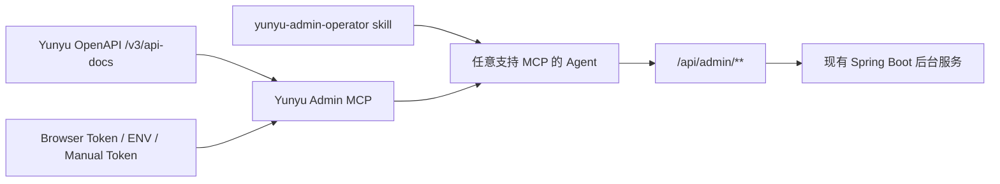

# OpenAPI 驱动的 AI 后台 Skill / MCP 技术方案（二期）

## 文档目标

本文档用于定义 `Yunyu` 如何基于现有后台接口与 `OpenAPI` 文档，构建一套可复用、可扩展、低维护的 AI 后台操作能力。

目标不是在站内重做一套 AI 后台业务系统，而是建设以下结构：

1. `OpenAPI` 作为后台能力源
2. `MCP` 作为统一执行层
3. `skill` 作为 agent 操作规范层

## 一、现状基础

当前仓库已经具备以下基础条件：

### 1.1 OpenAPI 文档能力

后端已启用 `springdoc`，并暴露：

- `/v3/api-docs`

从代码上可确认：

1. `application-dev.yml` / `application-prod.yml` 已开启 `springdoc.api-docs.path=/v3/api-docs`
2. `/v3/api-docs/**` 属于公开可访问路径

### 1.2 后台权限边界已存在

从 `SecurityConfiguration` 可以确认：

1. `/api/admin/**` 进入管理员安全链
2. 访问要求为 `hasRole("SUPER_ADMIN")`
3. 因此后台接口天然已经具备“只允许站长操作”的能力

### 1.3 前端 token 已有稳定来源

从 `useApiClient.ts` 可以确认：

1. token 存储键为 `yunyu_access_token`
2. 会写入 Cookie
3. 也会写入 `localStorage`
4. 请求时统一通过 `Authorization: Bearer <token>` 访问后端

这说明：

MCP 并不需要重做登录体系，只需要拿到站长 token 即可复用当前后台能力。

## 二、推荐总体结构



职责拆分如下：

### `OpenAPI`

负责：

1. 定义后台接口路径
2. 定义参数结构
3. 定义返回结构
4. 提供字段说明、summary、tag

### `Yunyu Admin MCP`

负责：

1. 加载并解析 OpenAPI 文档
2. 建立后台操作索引
3. 提供 agent 可调用的 MCP 工具
4. 注入和校验站长 token
5. 执行真实后台 HTTP 请求

### `yunyu-admin-operator skill`

负责：

1. 指导 agent 如何使用 MCP
2. 约束高风险操作的确认流程
3. 约束查询、修改、删除的工作顺序
4. 提示如何获取 token

## 三、为什么推荐 MCP 为执行层

如果不做 MCP，而只用 skill + shell/curl，会有以下问题：

1. 每个 agent 需要自己拼请求
2. token 使用方式不统一
3. OpenAPI 到可执行动作之间没有稳定桥梁
4. 后续更换 agent 时需要重新适配

MCP 的优势是：

1. 对 agent 暴露统一工具接口
2. 能统一封装鉴权、错误处理、schema 读取
3. 可以被多个 agent 复用
4. 更符合“后台能力基础设施”定位

## 四、为什么推荐 skill 为操作规范层

如果只暴露 MCP 工具，而没有 skill，agent 虽然“能调用”，但不一定“会正确调用”。

skill 的职责是让 agent 形成统一操作习惯，例如：

1. 先搜索接口，再执行
2. 写操作先预览
3. 删除操作先确认
4. 批量操作先展示命中范围
5. 参数不确定时先查 schema

因此推荐结构不是：

- 只做 MCP
- 或只做 skill

而是：

- `MCP + skill`

## 五、MCP 设计原则

## 5.1 不手写每个后台能力

MCP 不应为每个后台功能都手工写一套工具实现。

推荐方式是：

1. 启动时读取 `/v3/api-docs`
2. 自动筛选 `/api/admin/**`
3. 自动把每个操作转成内部索引对象
4. 对外只暴露少量稳定 MCP 工具

## 5.2 只暴露少量通用工具

推荐不要把几十上百个后台接口直接做成几十上百个 MCP tool。

更推荐以下 4 个核心工具：

### `search_admin_operations`

作用：

1. 按关键词搜索后台操作
2. 支持按 tag、path、method、风险等级过滤

### `get_admin_operation_schema`

作用：

1. 获取某个操作的详细参数 schema
2. 获取字段说明、必填项、示例值
3. 获取风险等级和确认要求

### `preview_admin_operation`

作用：

1. 对写操作生成预览信息
2. 给出即将访问的接口、请求参数、风险提示
3. 必要时做目标资源查找与变更摘要展示

### `execute_admin_operation`

作用：

1. 真正执行后台接口
2. 自动附带 Bearer Token
3. 返回标准化结果

### 可选 `get_admin_auth_status`

作用：

1. 检查当前 token 是否存在
2. 检查是否能通过 `/api/auth/me`
3. 检查角色是否为 `SUPER_ADMIN`

这套工具的优点是：

1. 工具数量稳定
2. skill 稳定
3. 新增后台接口时，不需要新增 MCP tool，只需让索引自动感知

## 六、OpenAPI 到 MCP 的转换策略

### 6.1 过滤规则

MCP 启动后读取 OpenAPI JSON，只保留：

1. path 以 `/api/admin/` 开头的操作

默认排除：

1. `/api/auth/login`
2. `/api/auth/register`
3. `/api/site/**`
4. `/actuator/**`
5. `/v1/**` AI 兼容协议接口

### 6.2 操作索引结构

建议将每个后台操作转换为统一结构：

```json
{
  "operationId": "updateSiteConfig",
  "summary": "更新站点配置",
  "method": "PUT",
  "path": "/api/admin/site-config",
  "tag": "后台站点配置",
  "requestBodySchema": {},
  "responseSchema": {},
  "riskLevel": "MEDIUM",
  "confirmRequired": true
}
```

### 6.3 风险等级默认规则

若 OpenAPI 中没有额外扩展信息，可先按 HTTP Method 推断：

1. `GET` -> `LOW`
2. `POST` -> `MEDIUM`
3. `PUT` -> `MEDIUM`
4. `DELETE` -> `HIGH`

若路径或 summary 中包含以下语义，可自动升级：

1. `delete` -> `HIGH`
2. `remove` -> `HIGH`
3. `test` -> `LOW`
4. `batch` -> `HIGH`
5. `publish` -> `HIGH`
6. `offline` -> `HIGH`

## 七、建议增强 OpenAPI，而不是维护额外清单

这是维护成本最低的关键点。

不要再单独维护一份“AI 能力清单文档”。

应当把 AI 需要的信息尽量沉淀到 OpenAPI 中。

### 7.1 建议补充 Security Scheme

当前 `OpenApiConfig` 只定义了基础 `Info`，建议补充：

1. `bearerAuth` security scheme
2. 后台接口的 security requirement

这样 MCP 与其他工具在读文档时能更明确知道这是 Bearer Token 接口。

### 7.2 建议补充字段描述

要让 agent 更智能，核心不是多写 prompt，而是让 DTO 字段更可理解。

建议在后台请求 DTO / VO 中逐步补充：

1. 字段中文说明
2. 示例值
3. 枚举说明
4. 是否必填

### 7.3 建议补充 OpenAPI 扩展字段

推荐通过 `springdoc` 的 customizer 自动给后台操作增加扩展字段，例如：

1. `x-yunyu-risk-level`
2. `x-yunyu-confirm-required`
3. `x-yunyu-owner-role`
4. `x-yunyu-sensitive-fields`

例如：

```json
{
  "x-yunyu-risk-level": "HIGH",
  "x-yunyu-confirm-required": true,
  "x-yunyu-owner-role": "SUPER_ADMIN"
}
```

这样 MCP 可以更稳地做预览与确认，而不需要额外维护一份映射表。

## 八、Token 获取与认证设计

## 8.1 Token 来源

推荐支持以下优先级：

### A. 浏览器上下文读取

若 agent 具备浏览器上下文能力，可直接读取：

```js
localStorage.getItem('yunyu_access_token')
```

或读取 Cookie 中的：

- `yunyu_access_token`

### B. 环境变量注入

例如：

- `YUNYU_API_BASE`
- `YUNYU_ACCESS_TOKEN`

### C. 手工设置

通过 MCP 配置或 tool 参数手工传入 token。

## 8.2 启动校验

MCP 在真正开放后台操作前，应先做一次认证校验：

1. 调用 `/api/auth/me`
2. 校验响应是否成功
3. 校验角色是否为 `SUPER_ADMIN`

若不是，则：

1. 禁止写操作
2. 或直接拒绝初始化后台操作能力

## 8.3 Token 生命周期

当调用后台接口返回未认证或 token 失效时，MCP 应：

1. 返回明确错误
2. 提示重新登录
3. 提示重新从浏览器读取 token

## 九、preview 机制设计

虽然 MCP 是执行层，但为了安全，建议保留一层轻量 preview。

### 9.1 读操作

如 `GET` 查询类操作，可直接执行。

### 9.2 写操作

如 `POST` / `PUT` / `DELETE`，建议支持：

1. 先显示目标接口
2. 显示请求参数摘要
3. 显示风险等级
4. 对删除和批量动作要求确认

### 9.3 preview 的实现方式

不要求后端新增 preview API。

第一版可以由 MCP 本身生成 preview 结果：

1. 根据 schema 解释参数
2. 根据 method/path 生成风险提示
3. 对需要先查目标对象的场景，允许先自动执行一次 GET 查询补全预览

## 十、Skill 设计建议

建议新建一个技能，例如：

- `yunyu-admin-operator`

### 10.1 skill 的职责

skill 不直接写死接口，而是写死工作流：

1. 接到后台操作需求时，先用 `search_admin_operations`
2. 定位操作后，用 `get_admin_operation_schema`
3. 如果是写操作，先生成或展示 `preview`
4. 高风险操作先确认
5. 再调用 `execute_admin_operation`
6. 最后总结执行结果

### 10.2 skill 需要写明的规则

至少包含：

1. 先查能力，不要猜接口
2. 不确定字段时先查 schema
3. 删除和批量操作必须二次确认
4. token 缺失时优先尝试从浏览器读取 `yunyu_access_token`
5. 若当前 token 对应用户不是 `SUPER_ADMIN`，不要尝试后台写操作

### 10.3 skill 为什么稳定

因为 skill 不关心你新增的是“友链接口”还是“专题接口”。

skill 只关心通用流程，因此后续新增功能时通常不用改 skill。

## 十一、推荐目录结构

如果在仓库内落地，建议采用“本地插件”结构：

```text
plugins/yunyu-admin-ops/
├── .codex-plugin/
│   └── plugin.json
├── skills/
│   └── yunyu-admin-operator/
│       └── SKILL.md
├── scripts/
│   └── read-browser-token.js
├── mcp/
│   └── server/
│       ├── index.ts
│       ├── openapi-loader.ts
│       ├── operation-indexer.ts
│       ├── risk-policy.ts
│       ├── auth-provider.ts
│       └── executor.ts
└── references/
    └── token-acquire.md
```

其中：

### `mcp/server`

负责：

1. 读取 `/v3/api-docs`
2. 建立操作索引
3. 暴露 MCP tools
4. 执行 HTTP 请求

### `skills/yunyu-admin-operator`

负责：

1. 规范 agent 的工作流
2. 说明 token 获取策略
3. 约束确认流程

## 十二、后续新增功能如何默认支持

这是本方案最核心的扩展点。

后续新增后台功能时，只要满足：

1. 新接口在 `/api/admin/**`
2. 出现在 `/v3/api-docs`
3. DTO 字段说明足够清晰

则：

1. MCP 重新加载 OpenAPI 后即可自动索引
2. skill 无需修改
3. agent 可直接通过同样工作流使用新能力

如果遇到特殊高风险动作，只需要补其中一项：

1. OpenAPI 扩展字段
2. 少量风险映射规则

而不是新增一整套 AI 功能。

## 十三、实施阶段建议

### M1：最小可用版

完成：

1. 读取 `/v3/api-docs`
2. 过滤 `/api/admin/**`
3. 提供 `search_admin_operations`
4. 提供 `get_admin_operation_schema`
5. 提供 `execute_admin_operation`
6. 支持手动 token 注入

### M2：安全增强版

完成：

1. 增加 `preview_admin_operation`
2. 增加 `/api/auth/me` 权限校验
3. 增加 token 失效处理
4. 增加浏览器 token 获取辅助脚本

### M3：文档增强版

完成：

1. OpenAPI bearerAuth 声明
2. DTO 字段描述增强
3. `x-yunyu-risk-level` 等扩展字段
4. skill 正式定稿

### M4：插件化交付

完成：

1. 封装为本地 plugin
2. 内含 MCP + skill
3. 供任意 agent 安装和调用

## 十四、风险与注意事项

### 14.1 OpenAPI 质量决定 agent 智能度

如果字段说明非常少，agent 仍然可能需要猜字段含义。

因此提升智能度最有效的方式之一，不是加 prompt，而是提升 OpenAPI 质量。

### 14.2 不建议让 MCP 直接自动执行所有写操作

即使有 token，也建议保留确认机制，尤其是：

1. 删除
2. 批量变更
3. 覆盖敏感配置

### 14.3 不建议把浏览器 token 抓取写成后端正式接口

更推荐：

1. 从浏览器存储读取
2. 或在本地插件中通过浏览器辅助脚本读取
3. 或让站长手工提供

不要为了让 agent 拿 token，再在服务端开放一个“吐出 token”的接口。

## 十五、结论

本项目更合适的技术路线是：

1. 以 `/v3/api-docs` 为后台能力源
2. 构建 `Yunyu Admin MCP` 作为统一执行层
3. 构建 `yunyu-admin-operator` skill 作为统一操作规范
4. 利用现有 `SUPER_ADMIN` + Bearer Token 体系完成鉴权
5. 通过 OpenAPI 自动发现实现“后续新增功能默认支持”

这条路线比“重建一层站内 AI 平台”更轻、更智能、更容易维护，也更符合“任意 agent 可复用”的目标。
