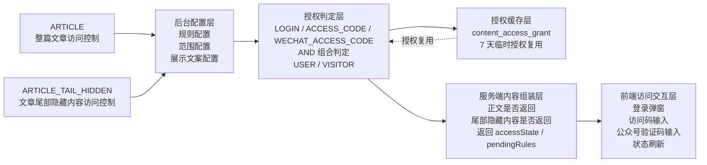

```mermaid
flowchart LR
    article["ARTICLE<br/>整篇文章访问控制"]
    tail["ARTICLE_TAIL_HIDDEN<br/>文章尾部隐藏内容访问控制"]
    config["后台配置层<br/>规则配置<br/>范围配置<br/>展示文案配置"]
    auth["授权判定层<br/>LOGIN / ACCESS_CODE / WECHAT_ACCESS_CODE<br/>AND 组合判定<br/>USER / VISITOR"]
    grant["授权缓存层<br/>content_access_grant<br/>7 天临时授权复用"]
    assemble["服务端内容组装层<br/>正文是否返回<br/>尾部隐藏内容是否返回<br/>返回 accessState / pendingRules"]
    frontend["前端访问交互层<br/>登录弹窗<br/>访问码输入<br/>公众号验证码输入<br/>状态刷新"]

    article --> config
    tail --> config
    config --> auth
    auth --> grant
    grant -. 授权复用 .-> auth
    auth --> assemble
    assemble --> frontend
```
