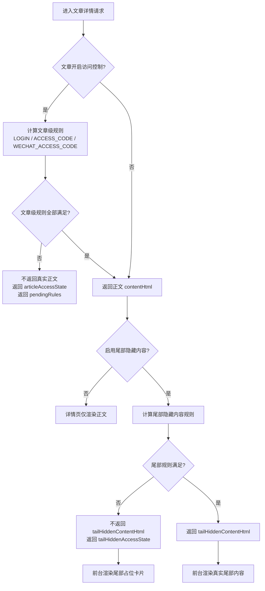

```mermaid
flowchart TD
    start["进入文章详情请求"]
    articleEnabled{"文章开启访问控制?"}
    articleCheck["计算文章级规则<br/>LOGIN / ACCESS_CODE / WECHAT_ACCESS_CODE"]
    articleGranted{"文章级规则全部满足?"}
    articleDenied["不返回真实正文<br/>返回 articleAccessState<br/>返回 pendingRules"]
    articleBody["返回正文 contentHtml"]
    tailEnabled{"启用尾部隐藏内容?"}
    detailOnly["详情页仅渲染正文"]
    tailCheck["计算尾部隐藏内容规则"]
    tailGranted{"尾部规则满足?"}
    tailDenied["不返回 tailHiddenContentHtml<br/>返回 tailHiddenAccessState"]
    tailAllowed["返回 tailHiddenContentHtml"]
    tailPlaceholder["前台渲染尾部占位卡片"]
    tailRender["前台渲染真实尾部内容"]

    start --> articleEnabled
    articleEnabled -- 否 --> articleBody
    articleEnabled -- 是 --> articleCheck
    articleCheck --> articleGranted
    articleGranted -- 否 --> articleDenied
    articleGranted -- 是 --> articleBody
    articleBody --> tailEnabled
    tailEnabled -- 否 --> detailOnly
    tailEnabled -- 是 --> tailCheck
    tailCheck --> tailGranted
    tailGranted -- 否 --> tailDenied
    tailGranted -- 是 --> tailAllowed
    tailDenied --> tailPlaceholder
    tailAllowed --> tailRender
```
