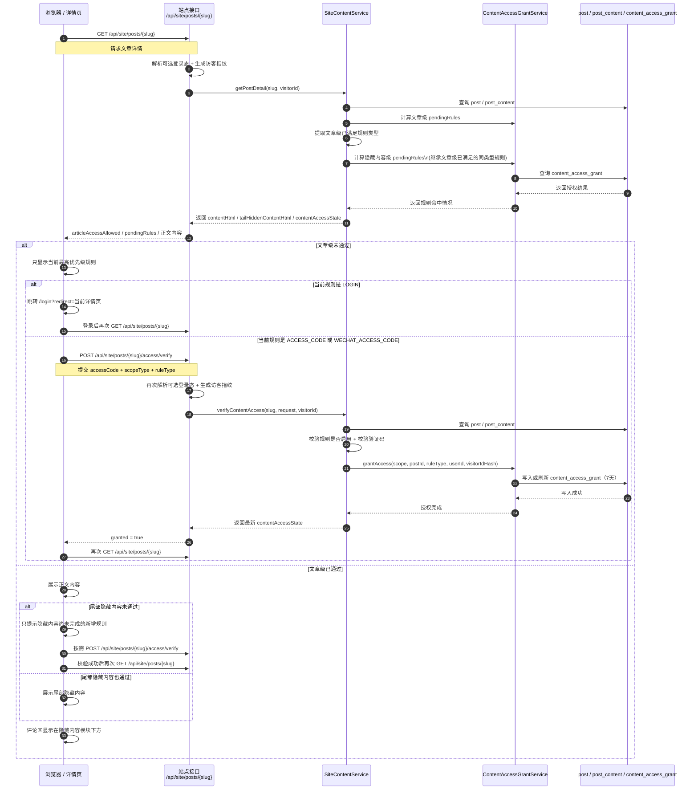

```mermaid
sequenceDiagram
    autonumber
    participant B as 浏览器 / 详情页
    participant A as 站点接口<br/>/api/site/posts/{slug}
    participant S as SiteContentService
    participant G as ContentAccessGrantService
    participant D as post / post_content / content_access_grant

    B->>A: GET /api/site/posts/{slug}
    Note over B,A: 请求文章详情
    A->>A: 解析可选登录态 + 生成访客指纹
    A->>S: getPostDetail(slug, visitorId)
    S->>D: 查询 post / post_content
    S->>G: 计算文章级 pendingRules
    S->>S: 提取文章级已满足规则类型
    S->>G: 计算隐藏内容级 pendingRules\n(继承文章级已满足的同类型规则)
    G->>D: 查询 content_access_grant
    D-->>G: 返回授权结果
    G-->>S: 返回规则命中情况
    S-->>A: 返回 contentHtml / tailHiddenContentHtml / contentAccessState
    A-->>B: articleAccessAllowed / pendingRules / 正文内容

    alt 文章级未通过
        B->>B: 只显示当前最高优先级规则
        alt 当前规则是 LOGIN
            B->>B: 跳转 /login?redirect=当前详情页
            B->>A: 登录后再次 GET /api/site/posts/{slug}
        else 当前规则是 ACCESS_CODE 或 WECHAT_ACCESS_CODE
            B->>A: POST /api/site/posts/{slug}/access/verify
            Note over B,A: 提交 accessCode + scopeType + ruleType
            A->>A: 再次解析可选登录态 + 生成访客指纹
            A->>S: verifyContentAccess(slug, request, visitorId)
            S->>D: 查询 post / post_content
            S->>S: 校验规则是否启用 + 校验验证码
            S->>G: grantAccess(scope, postId, ruleType, userId, visitorIdHash)
            G->>D: 写入或刷新 content_access_grant（7天）
            D-->>G: 写入成功
            G-->>S: 授权完成
            S-->>A: 返回最新 contentAccessState
            A-->>B: granted = true
            B->>A: 再次 GET /api/site/posts/{slug}
        end
    else 文章级已通过
        B->>B: 展示正文内容
        alt 尾部隐藏内容未通过
            B->>B: 只提示隐藏内容尚未完成的新增规则
            B->>A: 按需 POST /api/site/posts/{slug}/access/verify
            B->>A: 校验成功后再次 GET /api/site/posts/{slug}
        else 尾部隐藏内容也通过
            B->>B: 展示尾部隐藏内容
        end
        B->>B: 评论区显示在隐藏内容模块下方
    end
```
